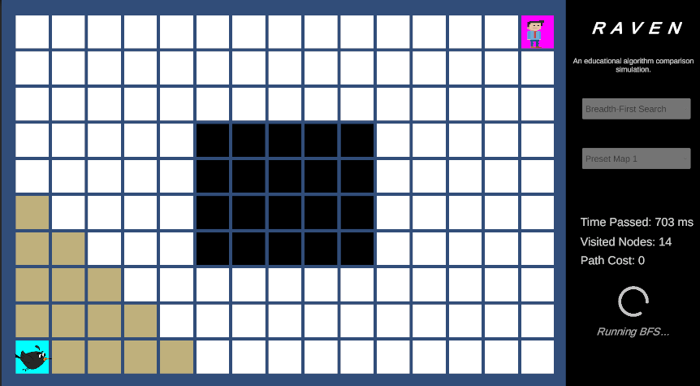
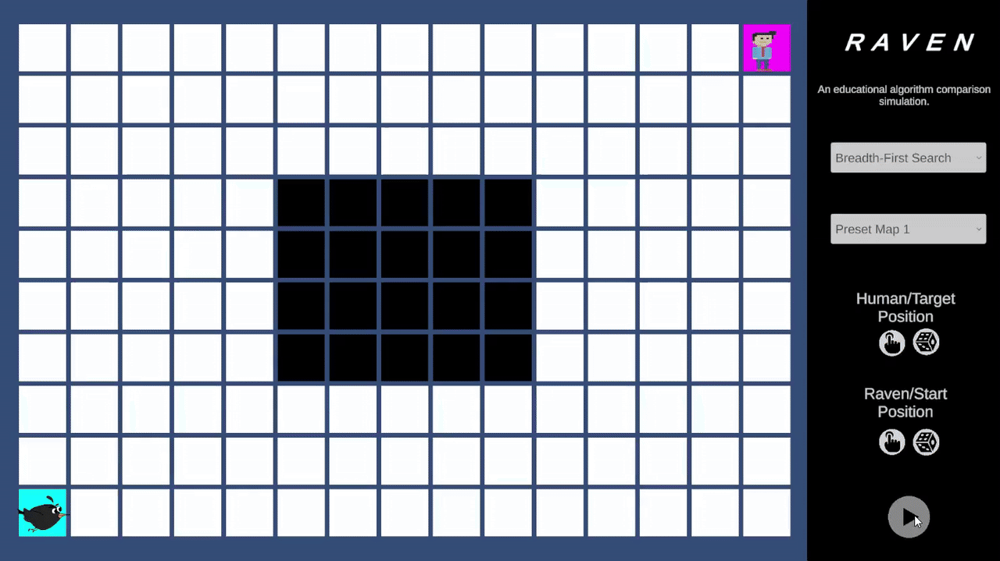
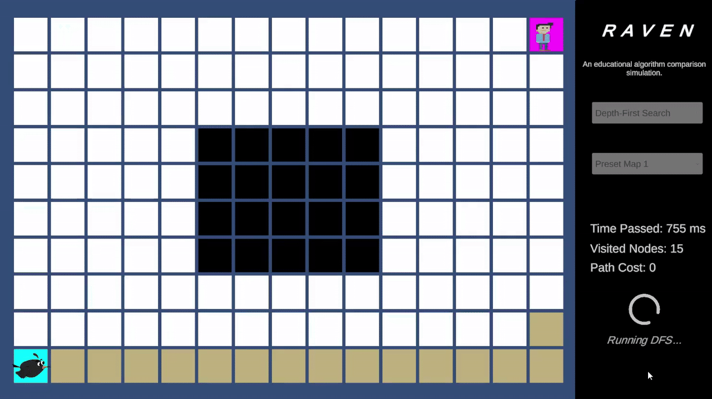
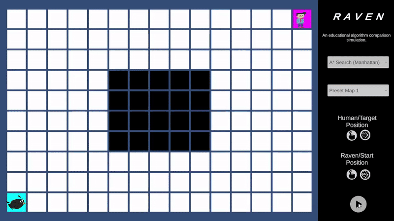

# RAVEN

A grid-based experimental environment for visual and performance-based comparison of classical search algorithms.

---

## 🎥 Demo Video

> Click the image below to watch the full project demonstration.

---

## 📌 Project Overview

RAVEN is an experimental grid-based environment designed to analyze and compare classical pathfinding algorithms both **visually** and **quantitatively**.  
The project focuses on how different search strategies behave under identical conditions when navigating toward a target in a constrained space.

---

## 🧩 Environment & Game Mechanics

- The environment is represented as a **2D grid map** with obstacles.
- **Raven** represents the start node.
- **Human** represents the target node.
- Start and target positions can be:
  - Manually placed
  - Randomly generated

### Map Types
- **3 predefined preset maps**
- **1 clear customizable map** for custom experiments

---

## 🧠 Implemented Algorithms

The following search algorithms are implemented and evaluated:

- **Breadth-First Search (BFS)**  
- **Depth-First Search (DFS)**  
- **A\* Search**  
  - Heuristic: Manhattan Distance

---

## 🧪 Experimental Setup

To ensure a fair comparison, all algorithms are evaluated under identical conditions:

- A **single fixed map** is selected for performance comparison.
- The same:
  - Start node position
  - Target node position
  - Obstacle layout
- This setup isolates algorithmic behavior and efficiency differences.

---

## 📊 Performance Metrics

The following metrics are collected during each run:

- **Execution Time**  
  Time required to reach the target node.

- **Visited Nodes**  
  Total number of nodes explored during the search.

- **Path Cost**  
  Length of the final path from start to target.

---

## 📈 Algorithm Performance Comparison

| Algorithm | Execution Time | Visited Nodes | Path Cost |
|---------|----------------|---------------|-----------|
| BFS     |    6507 MS     |      128      |    23     |
| DFS     |    5797 MS     |      114      |    95     |
| A*      |    1158 MS     |      22       |    23     |

---

## 🎞️ Visual Comparison (GIFs)

### Breadth-First Search (BFS)

Breadth-First Search (BFS) explores the grid **level by level**, expanding all nodes at the current depth before moving deeper.  
As a result, BFS is **guaranteed to find the shortest path** in an unweighted grid.

In this implementation, neighbors are enqueued in the order returned by `GetNeighbors`.  
While this **does not affect the optimality or correctness** of BFS, it **does influence the visual exploration pattern** and which equally optimal path is discovered first.

BFS typically visits a large number of nodes, especially in open areas, which often results in higher execution time, but it consistently produces the shortest path when one exists.

---

### Depth-First Search (DFS)

Depth-First Search (DFS) explores the grid by following a single path as deeply as possible before backtracking.  
Unlike BFS, DFS **does not guarantee the shortest path** and may explore long or inefficient routes before reaching the target.

The **neighbor insertion order returned by `GetNeighbors` directly affects DFS behavior**.  
Because DFS uses a stack (LIFO), the order in which neighbors are added determines:
- The direction of exploration
- The shape of the traversal
- Whether the algorithm quickly finds the target or explores irrelevant regions first

As a result, DFS can produce significantly different paths and visited node counts depending on neighbor ordering.  
This behavior is reflected in the results, where DFS explores fewer nodes than BFS but produces a significantly longer and suboptimal path.

---

### A* Search (Manhattan Distance)

A* Search combines path cost (`gCost`) and heuristic estimation (`hCost`) to prioritize nodes that are likely to lead toward the target efficiently.  
This implementation uses the **Manhattan Distance heuristic**, which is admissible and consistent for grid-based movement without diagonals.

Unlike BFS and DFS, A* is **largely insensitive to the neighbor insertion order**.  
Node expansion is driven primarily by the **lowest total cost (`fCost`)**, with heuristic guidance dominating the search behavior.

Neighbor order only becomes relevant when multiple nodes have identical `fCost` and `hCost` values, in which case it may cause minor variations in exploration order—but **not in path optimality**.

A* generally visits fewer nodes than BFS while still guaranteeing the shortest path under the given conditions.

---

## 🎮 How to Run (Windows)

This project is built for **Windows**. Follow the steps below to run the game:

#### 1️⃣ Download
Download the `RAVEN_Windows_Build.zip` file from the repository’s **Releases** section  
(or from the specific folder where the build is provided).

#### 2️⃣ Extraction
Locate the downloaded `RAVEN_Windows_Build.zip` file on your computer.

**Important:**  
Right-click the file and select **"Extract All..."**, or use a tool such as **WinRAR** or **7-Zip** to extract the contents into a new folder.

> ⚠️ **Note:** Do **not** attempt to run the game directly from inside the ZIP file.  
> The game will fail to load required assets if it is not fully extracted.

#### 3️⃣ Launch the Game
1. Open the extracted folder.  
2. Double-click **`RAVEN.exe`** to start the game.

---

### ⚠️ Important Notes

- **Folder Integrity:**  
  Do **not** move the `RAVEN.exe` file out of its folder.  
  It requires the `RAVEN_Data` folder and `UnityPlayer.dll` to be located in the same directory.

- **System Requirements:**  
  - Windows OS  
  - DirectX 11 or DirectX 12 compatible hardware  
  - Latest **Microsoft Visual C++ Redistributable** installed

